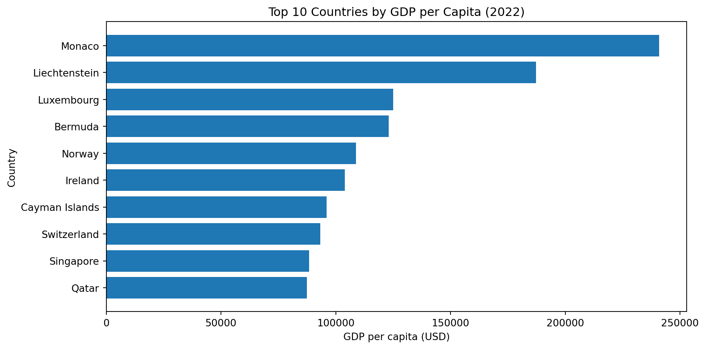
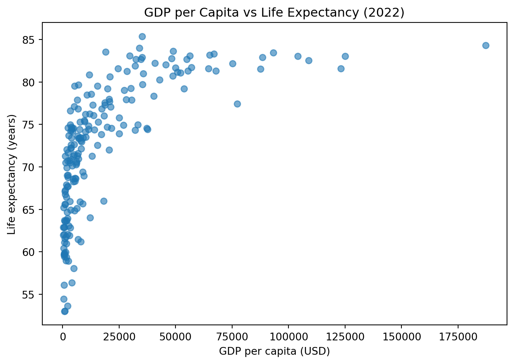

## Introduction

This presentation summarises the analysis of World Development Indicators (2022).

---

## GDP per Capita

- GDP per capita is highly right-skewed: a small number of economies have extremely high values.
- The top 10 are dominated by high-income economies (e.g., Monaco, Liechtenstein, Luxembourg).
---

## GDP and Life Expectancy

- There is a clear positive relationship between GDP per capita and life expectancy.
- The relationship shows diminishing returns: gains are steep at low income levels and flatten at higher incomes.
---

## Conclusion

- High-income countries dominate GDP rankings.
- There is a strong positive relationship between income and life expectancy.
- Significant inequality remains across countries.